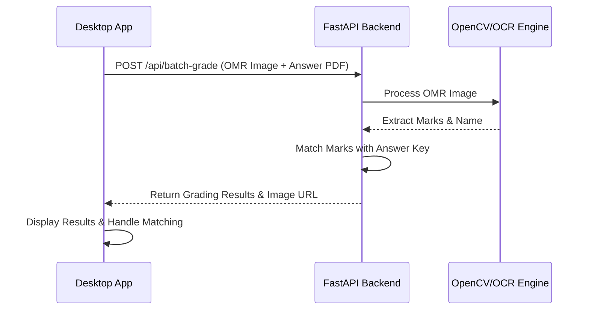
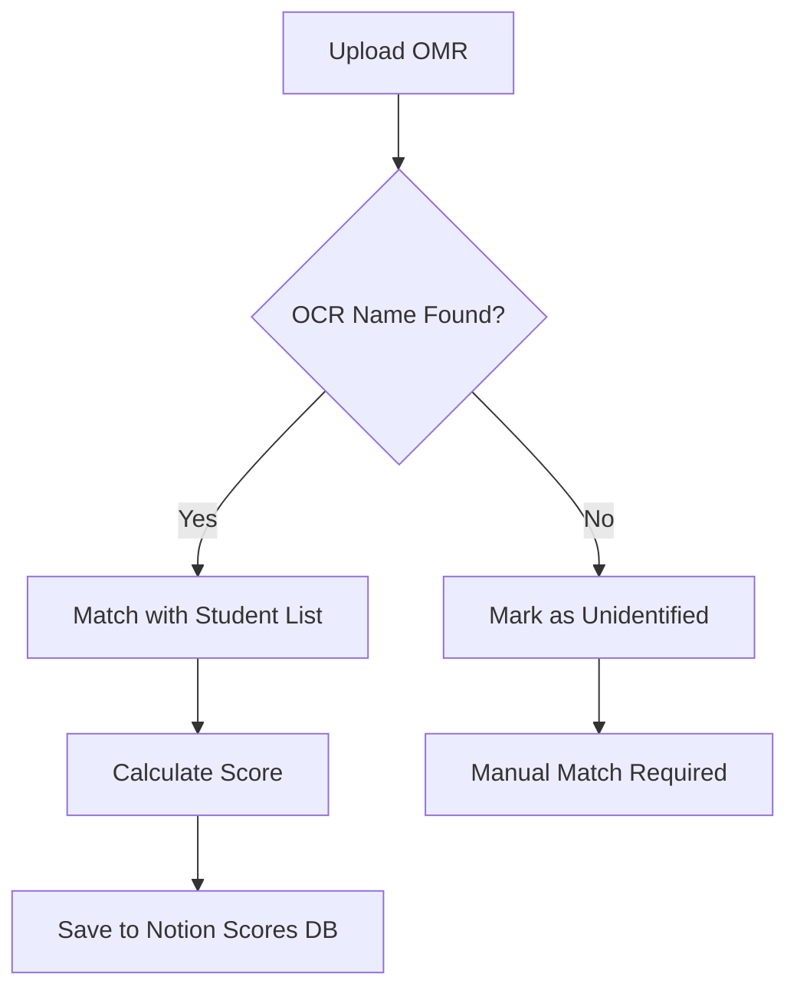

# Grader System Module

## Overview
The **Grader Module** (`/grader`) provides automated OMR grading using computer vision via a Python backend.

## OMR Processing Flow

## Grading Modes

### 1. Single Grading (단건 채점)
- Manual matching of a specific student to an OMR image.
- Review results immediately and save to Notion.

### 2. Batch Grading (일괄 채점)
- Automatic name recognition via OCR.
- Bulk saving of grading results for multiple students.

## Backend Interaction
Results are fetched from `http://localhost:8000/api/batch-grade`.

