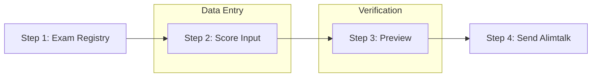
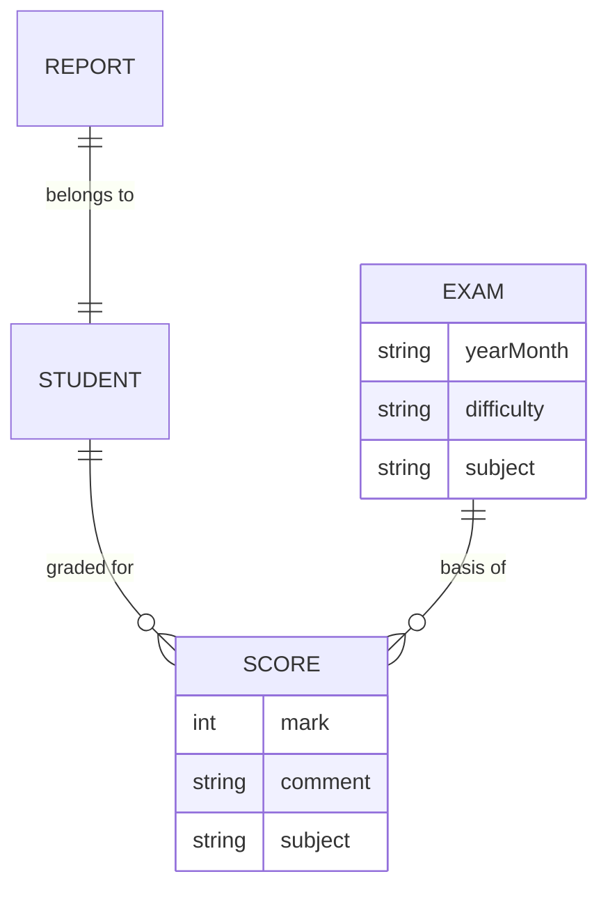

# Report System Module

## Overview
The **Report Module** (`/report`) manages monthly student evaluations, score entry, and report delivery via Alimtalk (KakaoTalk).

## Reporting Workflow

## Key Pages

### 1. Dashboard (대시보드)
- View current month's completion stats.
- See total students vs. completed reports.

### 2. Exam Management (시험 관리)
- Set difficulty levels (A-F) for monthly exams.
- Link PDF/Image exam papers.

### 3. Score Input (성적 입력)
- Input numeric scores and qualitative comments.
- **Auto-save** logic per subject.

### 4. Preview & Send (미리보기 및 전송)
- Generate report visualizations with charts.
- Send the final report link to parents.

## Data Model

