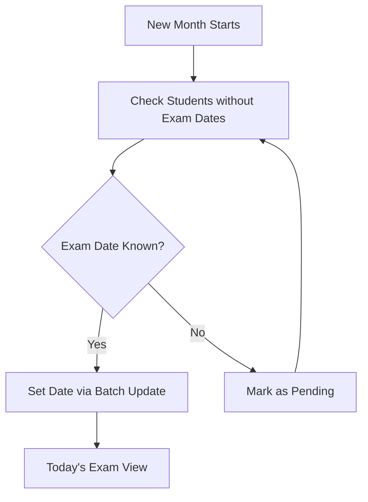

# Schedule System Module

## Overview
The **Schedule Module** (`/schedule`) tracks school-specific exam dates to help with preparation and target-setting.

## Exam Scheduling Logic

## Key Views

### 1. Today's Exams (오늘 시험)
- Shows students whose school exams are happening today.
- Useful for last-minute checklists or mental support.

### 2. Pending Exams (미지정 학생)
- List of students currently without an assigned exam date for the month.
- Teachers use this to fill in missing schedule gaps.

### 3. Exam History (시험 이력)
- Log of past exam dates and results (if linked).

## Feature: Batch Assignment
Select multiple students (e.g., all "High 2" students at same school) and apply a single exam date in one click.
