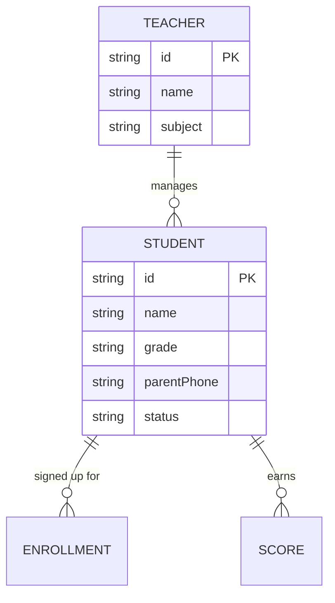
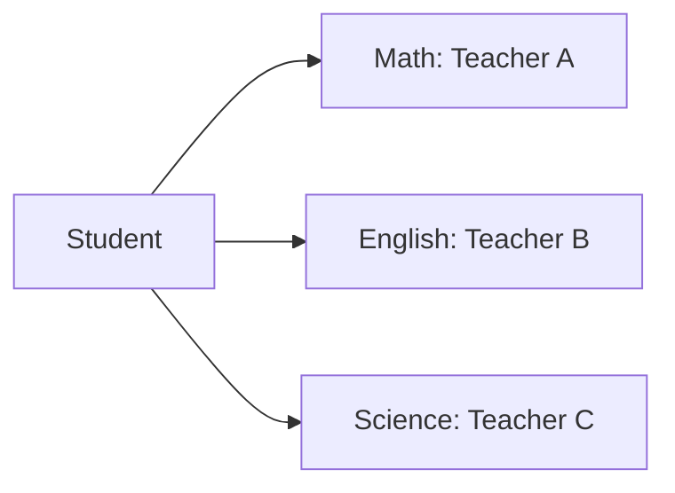

# Student Management Module

## Overview
The **Student Management Module** (`/student`) is the source of truth for all student data, synced with the Notion "Students" database.

## Database Relationships

## Features

### 1. Master List
- Search by name or phone.
- Filter by grade and active/inactive status.

### 2. CRUD Operations
- **Create**: Add new students with profiles and parent info.
- **Update**: Modify subjects, grades, or teacher assignments.
- **Delete**: Archive or remove student records.

### 3. Subject & Teacher Assignment
Mapping students to specific subjects and their respective managing teachers.

