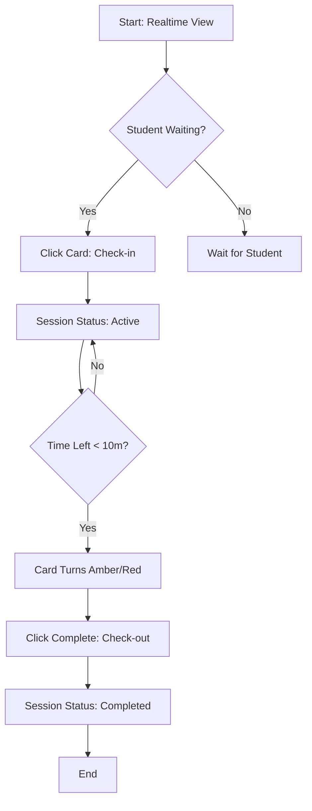
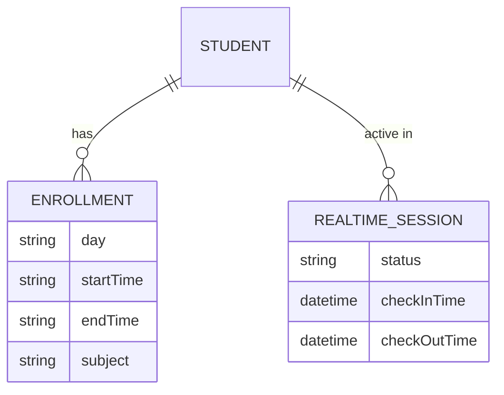

# Timer System Module

## Overview
The **Timer Module** (`/timer`) is used for daily schedule management and real-time class monitoring. It allows teachers to manage the check-in and check-out process for students attending classes.

## Features & Workflows

### Realtime Class Management
The core logic of the timer module is the real-time check-in/out flow.

### 1. Day View (요일별 보기)
- **Path**: `/timer/day`
- **Description**: Displays class schedules filtered by day, grade, and teacher.
- **Key Actions**: Filter by Mon-Sun, Filter by Grade, Search individual students.

### 2. Realtime Management (실시간 관리)
- **Path**: `/timer/realtime`
- **Description**: Live dashboard for today's attendees.
- **Key Actions**: Start session (Check-in), Complete session (Check-out).

### 3. Student View (학생별 보기)
- **Path**: `/timer/student`
- **Description**: Weekly schedule cards grouped by student.
- **Key Actions**: Edit/Delete student profile, View all enrollments.

### 4. Timeslot View (시간대별 보기)
- **Path**: `/timer/timeslot`
- **Description**: Visual heatmap of student distribution by time.
- **Key Actions**: Identify peak hours, View occupancy per 30-min block.

## Data Structure

